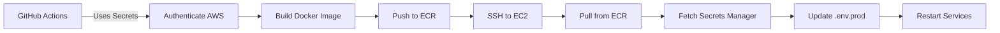

# Environment Variables Guide - Strapi Production

## Quick Reference

This guide explains which environment variables should be stored where for the Strapi production deployment.

## 📋 Storage Locations

### 1. Terraform Variables (Infrastructure Configuration)

**File**: `infra_code/envs/strapi/terraform.tfvars`

These are infrastructure-level configurations:

```hcl
# AWS Configuration
aws_region  = "us-west-2"
aws_profile = "rw1"

# Application Identity
APP_NAME = "dmair"
ENV      = "prod"

# EC2 Configuration
EC2_INSTANCE_TYPE    = "t3.small"
EC2_ROOT_VOLUME_SIZE = 12
EC2_PRIVATE_KEY      = "dmair-starpi"
EC2_AMI              = "ami-00f46ccd1cbfb363e"

# Security
S3_cors_Allowed_Origins = ["https://example.com"]

# SSH Keys (for EC2 access)
github_actions_ssh_public_key = "ssh-ed25519 AAAA..."
jenkins_ssh_public_key        = "ssh-rsa AAAA..."
```

### 2. AWS Secrets Manager (Application Secrets)

**Created by Terraform**: `dmair-prod` secret

Store sensitive application secrets here:

```json
{
  "APP_KEYS": "key1,key2,key3,key4",
  "API_TOKEN_SALT": "random_base64_string",
  "ADMIN_JWT_SECRET": "random_base64_string",
  "TRANSFER_TOKEN_SALT": "random_base64_string",
  "JWT_SECRET": "random_base64_string",
  "ENCRYPTION_KEY": "random_base64_string",
  "DATABASE_PASSWORD": "secure_password",
  "DATABASE_USERNAME": "strapi_user",
  "DATABASE_NAME": "strapi_prod",
  "DATABASE_HOST": "mysql"
}
```

**How to update**:
```bash
aws secretsmanager put-secret-value \
  --secret-id dmair-prod \
  --secret-string '{"APP_KEYS":"..."}' \
  --region us-west-2 \
  --profile rw1
```

### 3. GitHub Secrets (CI/CD Configuration)

**Location**: GitHub Repository → Settings → Secrets and variables → Actions

Required secrets for GitHub Actions workflow:

| Secret Name | Purpose | How to get |
|-------------|---------|------------|
| `AWS_ACCESS_KEY_ID` | AWS authentication | `terraform output -raw github_actions_access_key_id` |
| `AWS_SECRET_ACCESS_KEY` | AWS authentication | `terraform output -raw github_actions_secret_access_key` |
| `AWS_REGION` | AWS region | `us-west-2` |
| `EC2_HOST` | EC2 server IP | `terraform output -raw eip_public_ip` |
| `EC2_USER` | SSH user | `ubuntu` |
| `SSH_PRIVATE_KEY` | SSH deployment | Your generated private key |
| `SECURITY_GROUP_ID` | For dynamic SSH access | `terraform output -raw security_group_id` |
| `ECR_REPOSITORY` | Docker registry | `terraform output -raw ECR-Repository-URI` |

### 4. Production .env File (Runtime Configuration)

**File**: `.deploy/.env.prod` on EC2 instance

These are runtime environment variables for the Docker container:

```bash
# Docker Images (from ECR)
STRAPI_IMAGE=<ECR_URL>:latest
NGINX_IMAGE=<ECR_URL>-nginx:latest

# Ports
STRAPI_PORT=1337
MYSQL_PORT=3306

# Domain (for SSL)
DOMAIN=api.dmair.net
SSL_EMAIL=admin@dmair.net

# Runtime Config
NODE_ENV=production
HOST=0.0.0.0
PORT=1337

# Database Config
DATABASE_CLIENT=mysql
DATABASE_HOST=mysql
DATABASE_PORT=3306
DATABASE_NAME=strapi_prod
DATABASE_USERNAME=strapi_user
DATABASE_PASSWORD=<FROM_SECRETS_MANAGER>
DATABASE_SSL=false

# Strapi Secrets (FROM SECRETS MANAGER)
APP_KEYS=<FROM_SECRETS_MANAGER>
API_TOKEN_SALT=<FROM_SECRETS_MANAGER>
ADMIN_JWT_SECRET=<FROM_SECRETS_MANAGER>
TRANSFER_TOKEN_SALT=<FROM_SECRETS_MANAGER>
JWT_SECRET=<FROM_SECRETS_MANAGER>
ENCRYPTION_KEY=<FROM_SECRETS_MANAGER>
```

**Note**: The secrets should be fetched from AWS Secrets Manager during deployment.

## 🔒 Security Best Practices

### Never Commit to Git
- Private SSH keys
- AWS access keys
- Database passwords
- Strapi secret keys
- Any `.env.prod` file

### Use Secrets Manager For
✅ Database credentials  
✅ API keys and tokens  
✅ JWT secrets  
✅ Encryption keys  
✅ Third-party service credentials

### Keep in Terraform For
✅ Infrastructure sizing (instance types, volume sizes)  
✅ Network configuration (CORS origins)  
✅ Public configurations (regions, AMI IDs)  
✅ SSH **public** keys (for EC2 access)

## 🔄 Deployment Flow



## 📝 Generating Secure Values

For Strapi secrets, use:

```bash
# Generate random base64 string
node -e "console.log(require('crypto').randomBytes(32).toString('base64'))"

# Generate 4 APP_KEYS at once
node -e "console.log([1,2,3,4].map(() => require('crypto').randomBytes(16).toString('base64')).join(','))"
```

## 🚀 Initial Setup Checklist

- [ ] Generate SSH key pair for GitHub Actions
- [ ] Update `terraform.tfvars` with SSH public key
- [ ] Run `terraform apply`
- [ ] Save Terraform outputs to GitHub Secrets
- [ ] Generate Strapi secrets
- [ ] Store Strapi secrets in AWS Secrets Manager
- [ ] Configure GitHub Actions workflow
- [ ] Test deployment

## ❓ FAQ

**Q: Should I use .env files on EC2?**  
A: Yes, but fetch secrets from Secrets Manager during deployment, don't hardcode them.

**Q: How do I rotate secrets?**  
A: Update Secrets Manager, then redeploy to fetch new values.

**Q: What about frontend environment variables?**  
A: Frontend will need its own setup (separate infrastructure). Store build-time vars in GitHub Secrets, runtime configs in Secrets Manager.

**Q: Can I use RDS instead of Docker MySQL?**  
A: Yes! Create RDS instance via Terraform, store credentials in Secrets Manager, update `DATABASE_HOST` to RDS endpoint.
